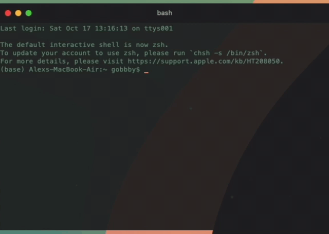

# pasteCalc
Simple terminal clipboard calculator that finds solutions to full formulas

## usage:
Copy a full formula to your clipboard and run the program. It will print out the input and output, and automatically copy the output to your clipboard

## demo:

 In this demo, I type out the formula I want solved, copy it, run the program, and paste the solution

### tip:
As seen in the demo gif, you can create an alias for running the python file in your bash (or other shell) profile (I called mine <i>pcalc</i>). This, in combination with a hotkey to bring up the terminal window, makes getting solutions to formulas on the fly very easy
